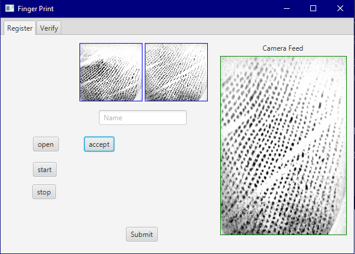
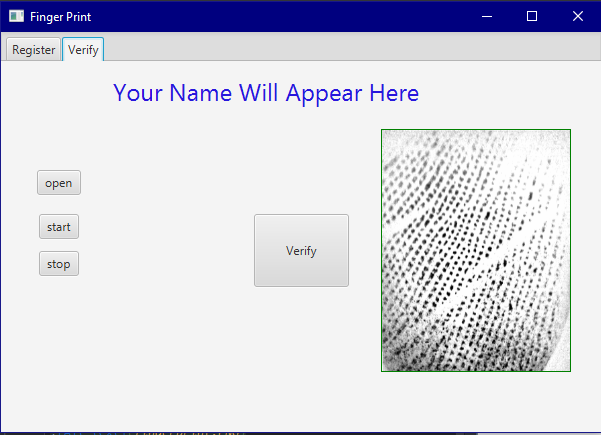

This is a simple project that allows you to register your name 
along with two fingerprints, and then verify you later on.

Database => MySQL
Database driver => jdbc (JAVA)
To setup your own DB:
create a schema named => fingerprint_test
create a table named => fingerprintinfo

table columns:
ID => primary key auto increment
Name => varchar(45)
temp1 => longtext
temp2 => longtext

You need ZK4500 fingerprint scanner or equivalent.
Fingerprint SDK is in deps folder in the project.
Java 8 is used.
Framework is JavaFX 8

Snapshot
Those prints are actually not my prints....

